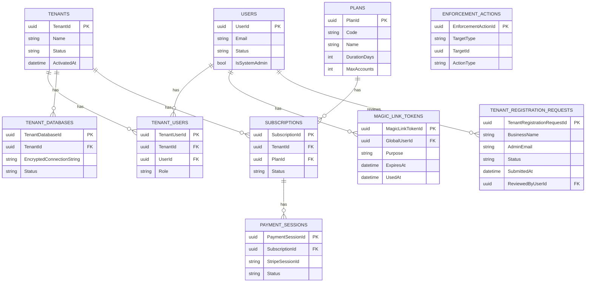

# Backend API Contract Mapping

This backend implements the RBAC endpoints expected by the Angular admin screens. The frontend can run against in-memory mocks or the real API.

Frontend method -> Backend endpoint -> DTO

- AuthService login refresh -> GET `api/me` -> `MeResponse`
- AuthService register -> POST `api/auth/register` -> `RegisterRequest`
- AuthService verifyEmailLink -> POST `api/auth/verify-email-link` -> `VerifyEmailLinkRequest`
- AuthService requestPasswordResetLink -> POST `api/auth/request-password-reset-link` -> `RequestPasswordResetLinkRequest`
- AuthService confirmPasswordResetLink -> POST `api/auth/confirm-password-reset-link` -> `ConfirmPasswordResetLinkRequest`
- AuthService requestChangePasswordLink -> POST `api/auth/request-change-password-link` -> none
- AuthService confirmChangePasswordLink -> POST `api/auth/confirm-change-password-link` -> `ConfirmChangePasswordLinkRequest`
- PublicTenantRegistrationService.create -> POST `api/public/tenant-registrations` -> `TenantRegistrationCreateRequest`
- PublicPlanService.getPlans -> GET `api/public/plans` -> `PublicPlanSummaryDto[]`
- OnboardingService.verifyMagicLink -> POST `api/onboarding/magic-link/verify` -> `OnboardingMagicLinkVerifyRequest`
- OnboardingService.setPassword -> POST `api/onboarding/set-password` -> `OnboardingSetPasswordRequest`
- OnboardingService.createCheckout -> POST `api/onboarding/subscriptions/checkout` -> `OnboardingCheckoutRequest`
- StripeWebhook -> POST `api/webhooks/stripe` -> none
- AdminRoleService.getRoles -> GET `api/admin/roles?page=&pageSize=&search=` -> `PagedResult<RoleSummaryDto>`
- AdminRoleService.createRole -> POST `api/admin/roles` -> `RoleCreateRequest`
- AdminRoleService.updateRole -> PUT `api/admin/roles/{roleId}` -> `RoleUpdateRequest`
- AdminRoleService.deactivateRole -> POST `api/admin/roles/{roleId}/deactivate` -> none
- AdminRoleService.reactivateRole -> POST `api/admin/roles/{roleId}/activate` -> none
- AdminComponentService.getComponents -> GET `api/admin/components?page=&pageSize=&search=` -> `PagedResult<ComponentSummaryDto>`
- AdminComponentService.createComponent -> POST `api/admin/components` -> `ComponentCreateRequest`
- AdminComponentService.updateComponent -> PUT `api/admin/components/{componentId}` -> `ComponentUpdateRequest`
- AdminComponentService.deactivateComponent -> POST `api/admin/components/{componentId}/deactivate` -> none
- AdminComponentService.reactivateComponent -> POST `api/admin/components/{componentId}/activate` -> none
- AdminPermissionService.getActions -> GET `api/admin/actions?page=&pageSize=&search=` -> `PagedResult<ActionSummaryDto>`
- AdminPermissionService.createAction -> POST `api/admin/actions` -> `ActionCreateRequest`
- AdminPermissionService.updateAction -> PUT `api/admin/actions/{actionId}` -> `ActionUpdateRequest`
- AdminPermissionService.deactivateAction -> POST `api/admin/actions/{actionId}/deactivate` -> none
- AdminPermissionService.activateAction -> POST `api/admin/actions/{actionId}/activate` -> none
- AdminPermissionService.getMatrix -> GET `api/admin/roles` + GET `api/admin/permissions` + GET `api/admin/roles/{roleId}` -> `RoleDetailDto`
- AdminPermissionService.saveMatrix -> PUT `api/admin/roles/{roleId}/permissions` -> `RolePermissionSetRequest`
- AdminUserService.getUsers -> GET `api/admin/users?page=&pageSize=&search=` -> `PagedResult<AdminUserSummaryDto>`
- AdminUserService.createUser -> POST `api/admin/users` -> `AdminUserCreateRequest`
- AdminUserService.updateUser -> PUT `api/admin/users/{userId}` -> `AdminUserUpdateRequest`
- AdminUserService.setUserRoles -> PUT `api/admin/users/{userId}/roles` -> `AdminUserRoleSetRequest`
- AdminUserService.deactivateUser -> POST `api/admin/users/{userId}/deactivate` -> none
- AdminUserService.reactivateUser -> POST `api/admin/users/{userId}/activate` -> none
- AdminUserService.suspendUser -> POST `api/system/enforcement/tenants/{tenantId}/users/{userId}/suspend` -> `EnforcementActionRequest`
- AdminUserService.banUser -> POST `api/system/enforcement/tenants/{tenantId}/users/{userId}/ban` -> `EnforcementActionRequest`
- AdminUserService.reinstateUser -> POST `api/system/enforcement/tenants/{tenantId}/users/{userId}/reinstate` -> none
- AdminTenantRegistrationService.get -> GET `api/admin/tenant-registrations?page=&pageSize=&status=&search=` -> `PagedResult<TenantRegistrationSummaryDto>`
- AdminTenantRegistrationService.approve -> POST `api/admin/tenant-registrations/{requestId}/approve` -> `TenantRegistrationReviewRequest`
- AdminTenantRegistrationService.reject -> POST `api/admin/tenant-registrations/{requestId}/reject` -> `TenantRegistrationReviewRequest`
- AdminTenantService.getTenants -> GET `api/admin/tenants?page=&pageSize=&status=&search=` -> `PagedResult<TenantSummaryDto>`
- AdminTenantService.getTenant -> GET `api/admin/tenants/{tenantId}` -> `TenantDetailDto`
- AdminTenantService.setAdmins -> PUT `api/admin/tenants/{tenantId}/admins` -> `TenantAdminSetRequest`
- AdminTenantService.suspendTenant -> POST `api/admin/tenants/{tenantId}/suspend` -> `EnforcementActionRequest`
- AdminTenantService.banTenant -> POST `api/admin/tenants/{tenantId}/ban` -> `EnforcementActionRequest`
- AdminTenantService.reinstateTenant -> POST `api/admin/tenants/{tenantId}/reinstate` -> none
- AdminPlanService.getPlans -> GET `api/admin/plans` -> `PlanSummaryDto[]`
- AdminPlanService.createPlan -> POST `api/admin/plans` -> `PlanCreateRequest`
- AdminPlanService.updatePlan -> PUT `api/admin/plans/{planId}` -> `PlanUpdateRequest`
- AdminPlanService.deactivatePlan -> POST `api/admin/plans/{planId}/deactivate` -> none
- AdminPlanService.activatePlan -> POST `api/admin/plans/{planId}/activate` -> none
- ProfileService.getProfile -> GET `api/users/profile` -> `UserProfileDto`
- ProfileService.updateProfile -> PUT `api/users/profile` -> `UpdateProfileRequest`
- ProfileService.uploadProfileImage -> POST `api/users/profile/photo` -> multipart form
- ProfileService.deleteProfileImage -> DELETE `api/users/profile/photo` -> none
- ProfileService.deleteAccount -> POST `api/users/profile/delete` -> none

Notes
- Permission policies use `PERM:<CODE>` and are enforced server-side.
- Tenant-scoped endpoints expect `X-Tenant-Id` when a user belongs to multiple tenants.

Tenant registration required fields:
- `businessName`
- `adminEmail`
- `phoneNumber`
- `businessRegistrationNumber`
- `businessType` (`VEHICLE_RENTAL` or `ACCOMMODATION`)

## SRS Updates (Change Set 1 + 2)

### Functional Requirements
- Provide a public tenant registration interface that captures business details, tenant admin email, and onboarding metadata.
- Create a control-plane `TenantRegistrationRequest` with status `PENDING_REVIEW` for each submission.
- Allow System Admins to approve or reject tenant registration requests.
- On approval, provision the tenant record, create the tenant database entry, and create an invited tenant admin user.
- Send a one-time magic link to the tenant admin email for onboarding.
- Allow magic link verification only for setting a password on first login.
- Require password setup before any other actions in onboarding.
- After password setup, allow selection of a subscription plan and redirect to payment checkout.
- Activate tenant only after first successful subscription payment.
- Allow System Admins to manage tenant admins (add/remove).
- Allow System Admins to manage subscription plans (price, duration, max accounts).
- Allow System Admins to suspend/ban tenants and users, and reinstate suspended entities.
- Enforce tenant/user status at authentication and authorization boundaries.
- Audit all onboarding and enforcement actions.

## Tenant-Scoped RBAC (Implemented)

System admin ownership (control-plane, single DB):
- `api/admin/tenant-registrations/*`
- `api/admin/tenants/*`
- `api/admin/plans/*`
- `api/system/enforcement/tenants/{tenantId}/users/*`
- Control-plane tables: `Tenants`, `Plans`, `Subscriptions`, `PaymentSessions`, `EnforcementActions`

Tenant admin ownership (tenant DB):
- `api/admin/users`
- `api/admin/roles`
- `api/admin/permissions`
- `api/admin/components`
- `api/admin/actions`

Behavior:
- Tenant context is required (`X-Tenant-Id` when user belongs to multiple tenants).
- Caller must be `TenantAdmin` for that tenant.
- System admin without tenant membership cannot use tenant RBAC/user management endpoints.
- Cross-tenant email uniqueness is enforced for tenant admin assignment flows (`tenant registration approval`, `admin user creation`, and `PUT /api/admin/tenants/{tenantId}/admins`).
- `POST api/admin/users/{userId}/deactivate|activate` is membership-only in tenant DB (`TenantDbContext.TenantUsers.IsActive`) and does not change global auth status or write `EnforcementActions`.
- `PUT api/admin/users/{userId}/roles` blocks removing `ADMIN` from the last tenant admin in that tenant.
- Enforcement writes are centralized in control-plane `ISystemEnforcementService`; tenant-admin controllers do not write `EnforcementActions`.
- `/api/system/*` control-plane endpoints are not blocked by tenant-status gating; tenant-status checks remain enforced for tenant-scoped RBAC routes.
- Each tenant DB now includes RBAC tables: `Roles`, `Permissions`, `RolePermissions`, `UserRoles`, `AppComponents`, `PermissionActions`.
- Tenant DB schema migration is auto-applied when tenant DB context is resolved (idempotent).

Predefined tenant system roles (currently 4):
- `ADMIN` (system): all currently available tenant permissions.
- `MANAGER` (system): `ADMIN.DASHBOARD.VIEW`, `ADMIN.USERS.VIEW`, `ADMIN.USERS.CREATE`, `ADMIN.USERS.EDIT`, `ADMIN.ROLES.VIEW`, `ADMIN.PERMISSIONS.VIEW`, `ADMIN.COMPONENTS.VIEW`, `MATCHER.VIEW`, `BALANCER.VIEW`, `TASKS.VIEW`, `JOURNAL.VIEW`, `ANALYTICS.VIEW`.
- `REVIEWER` (system): `ADMIN.DASHBOARD.VIEW`, `MATCHER.VIEW`, `BALANCER.VIEW`, `TASKS.VIEW`, `JOURNAL.VIEW`, `ANALYTICS.VIEW`.
- `USER` (system): `MATCHER.VIEW`, `BALANCER.VIEW`, `TASKS.VIEW`, `JOURNAL.VIEW`, `ANALYTICS.VIEW`.

Maintenance note:
- When you add new `AppComponents` or new permission codes, update `SqlServerTenantSchemaMigrator` to map those new codes into predefined system roles if needed.
- This keeps every tenant DB consistent after schema reconciliation.

### Non-Functional Requirements
- Store tenant DB connection strings encrypted at rest.
- Use expiring, single-use magic link tokens for onboarding.
- Ensure enforcement actions are logged with actor, timestamp, and reason.

## ERD (Control-Plane Only)



## Use Case Diagram (Change Set 1 + 2)

```mermaid
flowchart LR
    Applicant([Applicant]) -->|Submit Tenant Registration| UC1[Submit Tenant Registration]
    SystemAdmin([System Admin]) --> UC2[Review Registration]
    SystemAdmin --> UC3[Provision Tenant]
    SystemAdmin --> UC4[Send Magic Link]
    TenantAdmin([Tenant Admin]) --> UC5[Set Password (First Login)]
    TenantAdmin --> UC6[Activate Tenant Admin Account]
    SystemAdmin --> UC7[Suspend Tenant]
    SystemAdmin --> UC8[Ban Tenant]
    SystemAdmin --> UC9[Reinstate Suspended Tenant]
    SystemAdmin --> UC10[Suspend User]
    SystemAdmin --> UC11[Ban User]
    SystemAdmin --> UC12[Reinstate Suspended User]
```

## Activity Diagram (Change Set 1)

```mermaid
flowchart TD
    A[Registration Submitted] --> B[Create TenantRegistrationRequest (Pending Review)]
    B --> C{Admin Review}
    C -->|Approve| D[Provision Tenant + DB]
    C -->|Reject| R[Mark Request Rejected]
    D --> E[Create Tenant Admin (Invited)]
    E --> F[Send Magic Link]
    F --> G[Verify Link]
    G --> H[Set Password]
    H --> I[Select Plan + Pay]
    I --> J[Activate Tenant + Admin Account]
```

## Run Locally

Backend

1) Configure environment variables in `.env`.
2) Run the API:

```
cd finrecon360-backend-master/finrecon360-backend
dotnet run
```

System admin login:
- Credentials are seeded from `SYSTEM_ADMIN_EMAIL` and `SYSTEM_ADMIN_PASSWORD` on startup.
- First run after env update will create/update the user and assign `ADMIN` role.

Temporary local bypass (no Stripe):
- Set `TEMP_BYPASS_SEED_TENANT_ADMIN=true` and provide `TEMP_BYPASS_*` tenant admin values.
- On startup, backend seeds an active tenant admin + active tenant + temporary plan/subscription (`max users = 5`).
- This bypass is development-only and should be disabled once Stripe onboarding is used.

Frontend

```
cd finrecon360-frontend
npm install
ng serve
```

## Tests

Backend:

```
cd finrecon360-backend-master
dotnet test
```

Frontend:

```
cd finrecon360-frontend
ng test --watch=false
```

Note:
- Frontend unit tests run with `environment.test.ts` (`mockApi: true`) and are independent from backend seeding flags.
- `TEMP_BYPASS_SEED_TENANT_ADMIN` only affects backend startup seeding.

## Troubleshooting: `Invalid object name 'Tenants'`

If backend startup fails with `Invalid object name 'Tenants'`:
1. Confirm the app is running with migrations enabled (not `DesignTime`/`Testing` environment).
2. Run backend normally so `Database.Migrate()` executes on startup.
3. Restart after migrations complete.

Current seeder behavior:
- Temporary bypass seeding now checks table existence first.
- If control-plane tables are missing, bypass seeding is skipped with a log message instead of crashing.

## Migration Reconciliation Note

- `20260302123000_ReconcileControlPlaneSchema` is a forward-only reconciliation migration for control-plane alignment.
- It normalizes EF schema for `PaymentSessions`, `MagicLinkTokens`, and `EnforcementActions`.
- This migration rebuilds those three tables (intended for local/dev transition), so existing rows in those specific tables are reset.
- The system-admin control-plane ownership change for tenant/plan/enforcement is authorization and routing only, so no new EF migration is required.

## Required Environment Variables (names only)

- BREVO_API_KEY
- BREVO_SENDER_EMAIL
- BREVO_SENDER_NAME
- BREVO_TEMPLATE_ID_MAGICLINK_VERIFY
- BREVO_TEMPLATE_ID_MAGICLINK_INVITE
- BREVO_TEMPLATE_ID_MAGICLINK_RESET
- BREVO_TEMPLATE_ID_MAGICLINK_CHANGE
- FRONTEND_BASE_URL
- SYSTEM_ADMIN_EMAIL
- SYSTEM_ADMIN_PASSWORD
- SYSTEM_ADMIN_FIRST_NAME
- SYSTEM_ADMIN_LAST_NAME
- TEMP_BYPASS_SEED_TENANT_ADMIN
- TEMP_BYPASS_TENANT_NAME
- TEMP_BYPASS_TENANT_ADMIN_EMAIL
- TEMP_BYPASS_TENANT_ADMIN_PASSWORD
- TEMP_BYPASS_TENANT_ADMIN_FIRST_NAME
- TEMP_BYPASS_TENANT_ADMIN_LAST_NAME
- TENANT_DB_TEMPLATE
- STRIPE_API_KEY
- STRIPE_WEBHOOK_SECRET
- STRIPE_SUCCESS_URL
- STRIPE_CANCEL_URL
- ONBOARDING_TOKEN_ISSUER
- ONBOARDING_TOKEN_AUDIENCE
- ONBOARDING_TOKEN_EXPIRES_MINUTES

## Brevo Template Requirements

Magic-link templates must include:
- `{{ params.magicLink }}`
- `{{ params.expiresInMinutes }}`

If your template does not include these, update it in the Brevo dashboard (manual change required).

## Temporary Bypass Notes

The temporary tenant bypass is implemented in backend seeding (`DbSeeder`) to unblock local development before Stripe onboarding is fully configured.

What it seeds:
- Tenant admin `User` (active, email confirmed)
- Control-plane `Tenant` (active)
- `TenantUser` link with `TenantAdmin` role
- Temporary active plan/subscription with `MaxAccounts = 5`
- Tenant database provisioning and tenant-scoped `TenantUsers` record
- Tenant DB `UserRoles` assignment to `ADMIN` so tenant admin receives role/permission management tabs
- Tenant user creation limit enforcement (`POST /api/admin/users`) based on plan `MaxAccounts`
- Existing tenant admins are not demoted by seeding; temporary seeding only ensures the configured seed admin exists and has admin privileges.

How to disable cleanly:
1. Set `TEMP_BYPASS_SEED_TENANT_ADMIN=false`.
2. Restart API.
3. Use normal registration + approval + onboarding + Stripe checkout flow.

## Frontend Access Gate (Temporary Local Setting)

RBAC is still enforced in frontend via roles/permissions route guards.

Temporary local relaxation:
- `src/app/core/auth/access.guard.ts` currently uses `enforceTenantActiveStatus = false`.
- This disables the tenant-payment status gate for non-admin routes during pre-Stripe testing.

Rollback to strict paid access:
1. Set `enforceTenantActiveStatus = true` in `src/app/core/auth/access.guard.ts`.
2. Restart frontend.
3. Non-admin users will be denied when `tenantStatus !== 'Active'`.

## Deployment

Angular:
- `ng build` and deploy the generated static files.

Backend:
- `dotnet publish -c Release`
- Run behind a reverse proxy (Nginx/Apache/IIS).
- Use HTTPS and set environment variables in the host environment.
